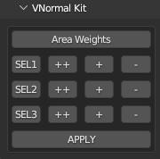

.. |video| raw:: html

	<video controls loop width="700">
		<source src="_static/vnorms.mp4" type="video/mp4">
		Your browser does not support the video tag.
	</video>

Mesh Layer Ops
===================================

.. _edgeweight:

Edge Weight Pie
---------------

A pie menu that gives quick access to setting discrete **Crease** weights to the
edge selection. There is a nested submenu for **Bevel Weight** if thats more your speed.

.. note::
	* Bind to a key in the addon Preferences in the ``Mesh`` context.

.. _vnormalkit:

VNormal Kit
-----------

	Panel for VNormal Kit

``VNormal Kit`` is an interface to setting custom vertex normals based on the selection set membership of faces
and sharp edges.

In order to use this tool, you must first ensure that **Auto Smooth** is enabled for the mesh. Also, any hard edges produced by a lower angle threshold
will be preserved when using the VNorms tools. So if you dont want that, be sure to set it to 180.0.

Vertex normals (also called Slip Normals Data) are computed in up to three passes using three selection sets respectively. Each pass iterates through all vertices and calculates
the Split Normal data by only considering neighboring faces that are members of that set. **If a vertex is not a member of a face, then it will not get a Split Normal.**

* You can add a face to a selection set by making a face selection and pressing the ``+`` button for one of the three selection sets.

* Pressing the ``-`` button will clear selected faces from the set.

* Holding down **Ctrl** will expose a ``++`` button which first clears set membership for all visible faces (for the relevant selection set row) and then adds the selected faces to the selection set.

* Pressing one of the ``SEL#`` buttons will select faces that are members of that set.

* Pressing ``Apply`` button will compute Split Normals data for the relevant set.

* Pressing the ``ALL`` button will run the ``Apply`` for each selection set.

* Toggling the ``Area Weights`` button will weigh generated Split Normals based on the surface area of neighboring faces.

So what faces get added to selection sets?
First lets define the problem: We want to make sure that edges and corners (even sharp ones) are slightly rounded. We also want smooth contiguous surfaces to have
defined boundaries and the area between boundaries to have a nice transition.
Thus we assign each boundary to the same selection set and exclude a trim of faces between each boundary (or loop of sharp edges). When we compute the Split Normals
by pressing ``Apply`` or ``ALL`` the result will be smooth shading within surfaces and a nice transition between each surface.
We can refine the shading of each surface by giving some faces membership to the other selection set.
The video below demonstrates some simple and more complex cases:

|video|

.. note::
	* Accessible from the rmKit-MeshLayers section of the tools panel.