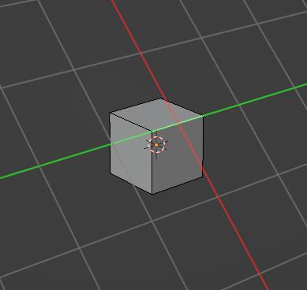
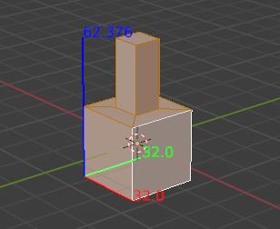
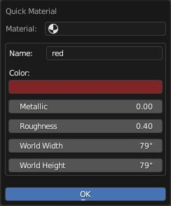

Utility Ops
===================================

.. _clipboard:

Mesh Clipboard
--------------

Three operators were added to allow the user to copy, cut, and paste selected faces.

* ``Copy`` : Copy the face selection to the clipboard.

* ``Cut`` : Copy the face selection to the clipboard and delete them from the mesh.

* ``Paste`` : Paste the geo from the clipboard to the active mesh.

.. note::
	* Bind in the addon Preferences in the ``3D View`` context or access it in the rmKit-Utils section of the tools panel.
	* It is preferable that you bind these to the same keys as their object mode variants.

.. _gridtoggle:

Grid Toggle
-----------

``Grid Toggle`` will toggle the visibility of the grid axis and floor grid or the workplane depending on what's currently visible.

.. note::
	* Bind in the addon Preferences in the ``3D View`` context or access it in the rmKit-Utils section of the tools panel.

.. _workplane:

Toggle Workplane
----------------

	Workplane drawn to visualize transform orientation aligned to selected edge.

The ``Toggle Workplane`` operator creates a transform orientation aligned to the current element selection and draws a grid aligned to said orientation.
Subsequent transform tools will automatically align to the active transform orientation. Manually changing the transform orientation or running the operator again
disables the workplane.
Many tools in the rmKit addon support the workplane.

.. note::
	* Bind in the addon Preferences in the ``3D View`` context or access it in the rmKit-Utils section of the tools panel.

.. _cursorpie:

3D Cursor Ops
-------------

A pie menu that contains quick access to default blender operations for managing the 3D Cursor as well as a few custom ones.
The points below only cover the custom operators:

* ``Cursor to Origin``: Same as ``Cursor to World Origin`` except it moves to the center of the workplane if active.

* ``Cursor to Selection and Orient``: Moves the 3D Cursor to the current selection and orients it based on the topology.
	
* ``Unrotate Relative to Cursor``: Unrotates the selected components based on the orientation of the 3D Cursor.

* ``Object Pivot to Cursor``: Move the pivot of the mesh to the 3D Cursor and adjust the position and orientation of linked meshes such that they do not move as a result of changed pivot.

.. note::
	* Bind in the addon Preferences in the ``3D View`` context or access it in the rmKit-Utils section of the tools panel.

.. _dimensionstool:

Toggle Dimensions
-----------------

	Dimensions drawn over selection.

Toggles the visibility of a set of world axes drawn over the current selection that displays the world space dimensions.

* Toggling ``Use Background Face Sel`` on will force the dimensions tool to measure the face selection while in vert or edge mode.

.. note::
	* Bind in the addon Preferences in the ``3D View`` context or access it in the rmKit-Utils section of the tools panel.

.. _itemnametomeshname:

Item Name to Mesh Name
----------------------

Copy the name of each item in the scene to its mesh data object.

.. note::
	* Operator is accessible as a button in the rmKit-Utils section of the tools panel.

.. _grabapplymaterial:

Grab Apply Material
-------------------

Sample the material under the mouse cursor and apply it to the selection faces.

.. note::
	* Bind to a key in the addon Preferences in the ``Mesh`` context.

.. _grabapplyvcolor:

Grab Apply Vertex Color
-----------------------

Sample the face corner colors under the mouse cursor and apply it to the selection.

.. note::
	* Bind to a key in the addon Preferences in the ``Mesh`` context.

.. _quickmaterial:

Quick Material
--------------

	Modal dialog for creating/modifying material.

This operator functions as a material creation utility. When executed, a modal dialog appears.
Before opening the modal dialog, the operator samples the material under the mouse cursor. From here,
changes to the material can be made via the properties exposed by the dialog.

* **Material** dropdown lets you select an active material. By default, the dialog is populated with the material initially sampled under the mouse cursor.
* Pressing the close button next to the Material dropdown will expose the **Name** input. Providing a name will create a new material and set it as active in the dialog.
* **Color** : The viewport color and albedo of the active material.
* **Metalic** : The metalness value of the active material.
* **Roughness** : The roughness value of the active material.
* **World Width** : The world scale of the 0-1 range of the U Texture Space axis. See :ref:`Scale to Material Size <scaletomatsize>` operator.
* **World Height** : The world scale of the 0-1 range of the V Texture Space axis. See :ref:`Scale to Material Size <scaletomatsize>` operator.
* **OK** : Pressing this will create a new material or modify the existing material using the inputs provided within the dialog.

.. note::
	* Bind to a key in the addon Preferences in the ``Mesh`` context.

.. _materialcleanup:

Material Cleanup
----------------

This operator removes unused materials on selected objects and adjusts the material indexing as needed.

.. note::
	* Bind in the addon Preferences in the ``3D View`` context or access it in the rmKit-Utils section of the tools panel.
