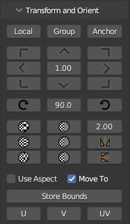
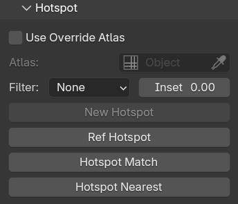

.. |video| raw:: html

	<video controls loop width="700">
		<source src="_static/uvboundstransform.mp4" type="video/mp4">
		Your browser does not support the video tag.
	</video>

.. |video1| raw:: html

	<video controls loop width="700">
		<source src="_static/hotspot.mp4" type="video/mp4">
		Your browser does not support the video tag.
	</video>

UV Edit Ops
===========

.. _uvloopringselection:

UVLoop / UVRing Selection
-------------------------

Alternate edge loop and edge ring selection algorithms.

* ``UV Loop`` : Extend current edge selection by loop. Utilizes 3DS Max algorithm.

* ``UV Ring`` : Extend current edge selection by ring. Utilizes 3DS Max algorithm.

.. note::
	* Bind to a key in the addon Preferences in the ``UV Editor`` context or find it in the rmKit section of the UV Editor tools panel.

.. _uvmovetofurthest:

UV Move to Furthest
-------------------

``UV Move to Furthest`` is used to quicly align uv components. Executing the operator opens a radial menu with relative directions. Selecting an option will
move all components of the selection to the furthest point in that direction. For example, selecting the **Left** option will flatten all selected elements to the
left most point included in the selection. This has the effect of aligning the selection along the vertical axis. Selecting the **Local** option will open a submenu
with more relative directions. Selecting one of these will evaluate each uv-discontinuous group of components separatly. This is particularly usefull if you want groups
of uv edges to be parallel to oneanother.
Click here to visit the docs for the 3D View version of this tool:: :ref:`Move to Furthest <movetofurthest>`

.. note::
	* Bind to a key in the addon Preferences in the ``UV Editor`` context.

.. _boundstransform:

Bounds Transform
----------------

|video|

``Bounds Transform`` is a modal tool that enables the use to transform the selected uv components using a bounding box toolhandle.
Click and drag within the box to move the entire selection, pull on a corner to resize along **U** and **V**, or pull on an edge
to resize along **U** or **V**.

.. note::
	* Bind to a key in the addon Preferences in the ``UV Editor`` context or find it in the rmKit section of the UV Editor tools panel.

.. _insetscaleuvs:

Inset Scale UVs
---------------

``Inset Scale UVs`` a modal operator that resizes selected uv islands by "insetting" int bounds of the selection.
This is particularly usefull which used in combination with the Hotspot tools.

.. note::
	* Bind to a key in the addon Preferences in the ``UV Editor`` context or find it in the rmKit section of the UV Editor tools panel.

.. _gridify:

Gridify
-------

``Gridify`` will map selected uv faces to a grid and preserve relative aspect ratios of each quad.
This operator is only compatible with grid topologies.

.. note::
	* Bind to a key in the addon Preferences in the ``UV Editor`` context or find it in the rmKit section of the UV Editor tools panel.

.. _rectanguarize:

Rectangularize
--------------

``Rectangularize`` attempts to map the uvs of the current face selection to a rectangle. Is does this by doing a conformal uv unwrap, identifying four corners,
flattening the edges in between, and relaxing the inner uv verts.

.. note::
	* Bind to a key in the addon Preferences in the ``UV Editor`` context or find it in the rmKit section of the UV Editor tools panel.

.. _stitch:

Stitch
------

``Stitch`` will weld two uv island together based on the use defined edge selection. Unlike Blenders default ``uv.stitch`` command, the target uv island is properly scaled and
oriented to minimize distortion when welding to the source island.

In sync mode, both islands are transformed to an average position and orientations. In unsync mode, the target uv-island is stitched to the source uv-island containing the edge
selection.

.. note::
	* Bind to a key in the addon Preferences in the ``UV Editor`` context or find it in the rmKit section of the UV Editor tools panel.

.. _unrotate:

Unrotate
--------

``Unrotate`` will rotate the uv-island thats part of the current edge selection such that each edge in the selection is aligned to the nearis uv grid axis.
In face mode, the rotation is based on the longest edge in the face selection.

.. note::
	* Bind to a key in the addon Preferences in the ``UV Editor`` context or find it in the rmKit section of the UV Editor tools panel.

.. _relativeislands:

Relative Islands
----------------

``Relative Islands`` is a command that scales uv-islands relative to oneanother such that they have the same texel density. It opens a modal dialog asking the user to specify the
method by which the target texel density is computed. Either the **Minimum** texel density found in the selection, the **Maximum** or the **Average**. Blender does have a
build in command for this, but it only averages the texel densities.

.. note::
	* Bind to a key in the addon Preferences in the ``UV Editor`` context or find it in the rmKit section of the UV Editor tools panel.

.. _scaletomatsize:

Scale to Material Size
----------------------

``Scale to Material Size`` will scale the selected uv-islands to the target texel density defined by the material via the :ref:`Quick Material <quickmaterial>` operator. Technically
the target is not a texel density because that would require an input image. Because of the prevelance of blended or composite materials in games, a texel density has become
a pretty meaningless metric. This a target world scale area density is used.

.. note::
	* Bind to a key in the addon Preferences in the ``UV Editor`` context or find it in the rmKit section of the UV Editor tools panel.

.. _uvgrowshrink:

UV Grow / UV Shrink
-------------------

``UV Grow`` and ``UV Shink`` were designed for use in unsync mode, where detatching faces from their neighbors is not possible with the move tool. Rather than immidiatly growing the face
selection it will first grow to include the overlapping vertices. Once they are all part of the selection, the next set of faces is selected. Running once more will include the overlapping
verts.
For example, select one uvface while in unsync mode. If you move the face around with the move tool observe that the face is still "welded" to its neighbors. Pressing ``UV Shrink`` once
will shring the uvloop selection. Moving the face now till detatch it from its neighbors.

.. note::
	* Bind to a key in the addon Preferences in the ``UV Editor`` context or find it in the rmKit section of the UV Editor tools panel.

.. _numtexuv:

Normalize Texels
----------------

``Normalize Texels U`` and ``Noemalize Texels V`` will scale uv islands along the **U** or **V** axes respectively, such that the texels on the first triangle per island is as square as possible.
This is particularly usefull when working with quad strips and Hotspots.

.. _uvtransform:

UV Transform and Orient
=======================

	GUI for UV Transform and Orient tools.

The ``Transform and Orient`` is a GUI designed to streamline uv mapping for environment art creation for games. Holding down modifier keys like **Ctrl**, **Alt**, or **Shift** will
change the icons and functionality of the button.
The uv tools are divided into four categories: Move/Slam, Rotate, Scale, and Fit. See below for breakdowns.

Move/Slam
---------

* ``Move``: Pressing the directional buttons will offset the uv selection by the amount specified in the center of the Move GUI buttons.

* ``Slam``: Holding down **Shift** will modify the direction buttons to include a grey dot. Pressing these will move the uv selection such that its bounds are flush with a side/corner of the unit uv square.

* ``Local Slam``: Holding down **Ctrl** will also change the direction button style; this time with a yellow dot. Pressing these will evaluate each selected uv-discontinuous element individually and move their respective bounds such that they are flush with a side/corner of the unit uv square.

* ``Anchor`` : Holding down **Alt** changes the directional button stile to include a red dot. Pressing these will toggle the state of the anchor for future transformations. An **Anchor** is a pinned corner or side of a bounding box. Subsequent transformation are done relative to this anchor. For example, anchoring the top left corner and rotating using the ``Rotate`` buttons bellow will rotate about the top left corner of the selection. This can be particularly usefull for things like scale and flip operations as well.

Rotate
------

* ``Rotate``: Pressing the rotate buttons will rotate clockwise or counter-clickwise by the angle amound specified in the center of the Rotate GUI buttons. If an **Anchor** point is set, rotations are done about the point in the evaluated bounds.

* ``Rotate Local``: Holding down **Ctrl** will change the rotate button style; this time with a yellow **L**. Pressing these will evaluate each selected uv-discontinuous element individually and move their separatly. If an **Anchor** point is set, rotations are done about the point in the evaluated bounds.

Scale
-----

* ``Scale``: Pressing the scale buttons will scale the uv selection by the scale factor specified in the top right of the Scale GUI buttons. The first column is for scaling up, and the second column is for scaling down. The first row is for **UV** scaling, the second row is for **U** scaling, and the third is for **V** scaling. The two buttons on the bottom right are for flipping about **V** and **U** respectively. If an **Anchor** point is set, scaling is done relative to a point in the evaluated bounds.

* ``Local Scale``: Holding down **Ctrl** will change the scale button style; this time with a yellow **L**. Pressing these will evaluate each selected uv-discontinuous element individually and move their separatly. If an **Anchor** point is set, scaling is done relative to a point in the evaluated bounds.

Fit
---

The purpose of the ``Fit`` tools is to map the selected uv elements to a cached bounding box.

* ``Store Bounds``: Will store the bounds of the current uv selection. This is the bounds you will fit to.

* ``Fit U``: Will map the width of the current uv selection to the width of the cached bounds.

* ``Fit V``: Will map the height of the current uv selection to the height of the cached bounds.

* ``Fit UV``: Will map both the width and height of the current uv selection the the cached bounds.

* When ``Use Aspect`` is on, the aspect ratio of the current uv selection will be preserved when mapping to the cached bounds.

* When ``Move To`` is checked, the current uv selection will be moved to the center of the cached bounds during a mapping.

* **Fit Local**: Holding down **Ctrl** will change the fit buttons to read **LU**. Pressing these will perform a fit operation on each uv-discontinuous element separatly.

* **Fit Grid**: Holding down **Shift** will change the fit buttons to read **GU**. Pressing these will fit to the unit square rather than the cached bounds.

.. _hotspot:

UV Hotspot
==========

Introduction
------------

	GUI for UV Hotspot tools.

Hotspoting reffered to a uving practice whereby the user divides a texture into a sequence of bounding boxes, and patches of geometry is mapped
to the bounds that best fits the aspect ratio and target texel density. It's a streamlined way to uv unwrap a model that
aims to minimize the time spend fidgeting with uvs.

Example Hotspot Atlas.

By mapping the surfaces of a mesh to the available hotspots in the atlas, we can quickly and easily make a model appear detailed and seamless by
capitalizing on the bevels and contextual grime on the boarders of each hotspot.

|video1|

Some hotspot tools are available in the tools panel in the rmKit section of the 3D View and the UV View. Others need to be bound in the addon Preferences.
See below for more information.

There are two way to use the hotspot tools. First is to save all your atlases into the user archive along with a unique material name respectively. When you
call a hotspot command, the material on the selected faces are used to lookup the appropriate atlas to map to. The second is to have an atlas mesh object in
your scene and use it as an override to all archived atlases. Both approaches are perfectly valid.

* ``New Hotspot``: In order to use a hotspot, it must first be added to the user archive. Create a plane and apply the hotspot material. Then slice up the mesh such that each quad is mapped to a hotspot in the texture. Once done, go into object mode with the plane selected and press the button. The hotspot data is now saved and the Match, Nearest, and MOS commands can now be used for this material!

* ``Ref Hotspot``: It is common to reuse the same hotspot configuration across multiple materials. Thus, it is necisary to reference an existing hotspot in the archive rather than creating a duplicate. With a polygon of the ref hotspot material selected, press the button and select the icon with the hotspot atlas configuration you wish to reference.

* ``Use Override Atlas``: If you wish to use a temp hotspot atlas without saving it to the archive you can load a sliced up mesh into the ``Atlas`` property and use it for all Subsequent hotspot operations.

* ``Use Trims``: Hotspotting can also be used for trim textures where the hotspot tiles infinitly along the **U** or **V** axis. When checked, subsequent hotspot operation will map the geometry to a hotspot like normal. But if the hotspot maps from 0-1 along an axis, then the uv's will be allowed to tile along that axis.

* ``Ins``: Inset the uvs after hotspoting by the provided scalar value. This is usefull when you want to shrink boundary bevels/detals. Alternatively, you can use the :ref:`Inset Scale UVs <insetscaleuvs>` operator.

* ``Hotspot Match``: In the **UV View** it will map the selected uv faces to the best fit hotspot pertaining to the material on said faces. In the **3D View** the selected faces are unwrapped and scaled to the world scale target before being mapped to the best fit hotspot for that material. The auto-unwrapping breaks up uv islands based on auto smoothing angle, sharp edges, and seam edges. The world scale target is defined by the material in the :ref:`Quick Material <quickmaterial>` dialog.

* ``Hotspot Nearest``: In the **UV View** it will map the selected uv faces to the hotspot nearest to that uv island.

* ``Hotspot MOS``: The command must be bound in the addon preferences and only works in the **UV View**. Using the atlas defined by the materials of the selected faces, it finds the hotspot under the mouse cursor and mapps all selected uv island to said hotspot.

* ``GrabApplyUVBounds``: The command must be bound in the addon preferences and only works in the **3D View**. While, not strictly a Hotspot tool, it can be looked at as a 3D variant of ``Hotspot MOS``. It maps the bounds of the uvs of the current face selection to the bounds of the uv-island of the face under the mouse cursor.